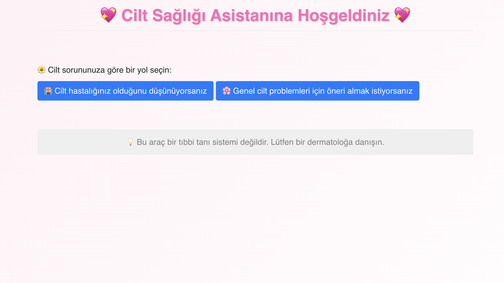
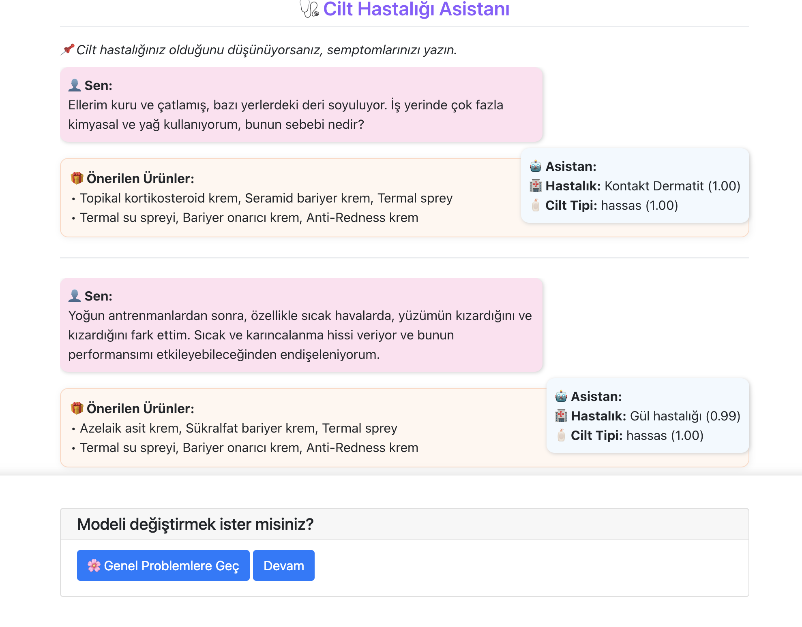
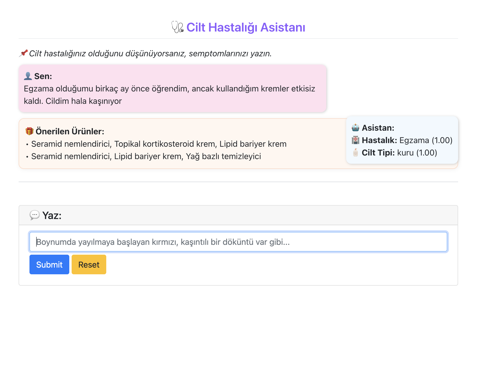
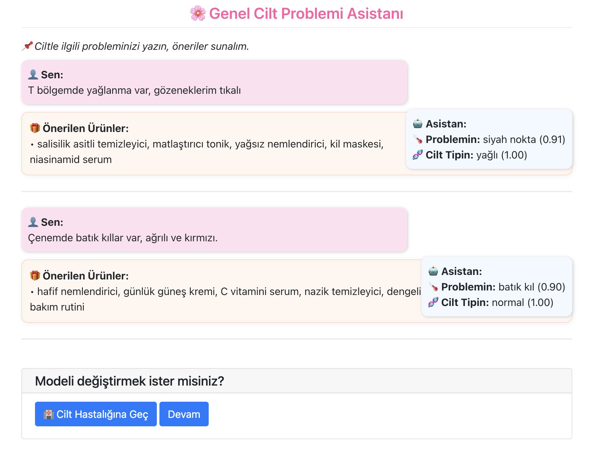

# 💖 Cilt Sağlığı Asistanı - AI Destekli Chatbot

> Türkçe NLP destekli, yapay zekâ tabanlı bir cilt hastalığı ve cilt problemi tahmin uygulaması 🧠 + 🎁 öneri motoru + 💬 interaktif chatbot arayüzü.

---

## 🧠 Proje Hakkında
Bu proje, cilt sorunlarını analiz ederek hem **teşhis** hem de **ürün önerisi** sunan, yapay zekâ destekli interaktif bir Python uygulamasıdır. Kullanıcılar, doğal bir şekilde semptomlarını serbest metin olarak ifade ederler. Sistem, bu metni analiz ederek ciltle ilgili olası problemleri ya da hastalıkları tahmin eder ve ardından uygun ürün önerilerinde bulunur.

Arka planda çalışan iki farklı NLP modeli sayesinde sistem; hem **cilt hastalıklarını** (örneğin egzama, akne, dermatit) hem de **genel cilt problemlerini** (örneğin kuruluk, pullanma, yağlanma) başarıyla ayırt edebilir. Ayrıca her tahminle birlikte kullanıcının **cilt tipi** (yağlı, kuru, karma, hassas vb.) de belirlenir.

Uygulama sadece teşhisle kalmaz; aynı zamanda tahmin edilen hastalık veya probleme yönelik **cilt bakımı ürünlerini** kullanıcıya önererek, bilgilendirici ve yönlendirici bir deneyim sunar. Bu öneriler, veri setinde yer alan ürün tavsiyelerinden türetilmiştir.

Kullanıcı dostu bir PyWebIO arayüzü ile çalışan sistem, sohbet tarzında etkileşimli bir deneyim sunar. Model seçim ekranı sayesinde kullanıcı, BERT veya Keras tabanlı analizi tercih ederek farklı tahmin motorlarını deneyimleyebilir.

### 🔍 Çift Modelli Mimari

| Model Türü        | Kullanım Alanı                   | Teknoloji              |
|-------------------|----------------------------------|------------------------|
| Keras (BiLSTM)    | Cilt hastalıkları + cilt tipi    | TensorFlow/Keras       |
| HuggingFace BERT  | Cilt problemi + cilt tipi        | Transformers/PyTorch   |

Her model, Türkçe veri setiyle sıfırdan eğitilmiştir. Kullanıcı dostu PyWebIO arayüzü sayesinde bu iki model arasında geçiş yapılabilir.

---

## 📦 Özellikler

- 🔁 Model geçiş butonları (Keras ↔️ BERT)
- 🧴 Cilt tipi ve problemi eşleştirmeli ürün öneri motoru
- 🧠 Güven skoru ile tahmin doğruluk bildirimi
- 📊 Sınıf bazlı doğruluk grafikleri ve confusion matrix’ler
- 🎨 CSS destekli hoş bir arayüz (chat baloncukları, ürün kutuları, emoji desteği)
- 🔐 Pickle ile kayıtlı `tokenizer`, `LabelEncoder`, `model` dosyaları

---

---

## 📁 Model Dosyaları Hakkında

> 🔔 **Not:** Cilt hastalıklarını tahmin eden Keras modeli (`model_keras`) ve cilt problemlerini tahmin eden BERT modeli (`bert-problem-model`) dosya boyutları nedeniyle bu GitHub reposuna dahil edilmemiştir.

Bu modellerin çalıştırılabilmesi için:

- `app.py` dosyası çalıştırıldığında, modeller veri seti ile **sıfırdan** eğitilecek şekilde yapılandırılmıştır.
- Eğitim süreci tamamlandıktan sonra:
  - Keras modeli `.h5` formatında,
  - BERT modeli ise `./bert-problem-model/` klasörüne **otomatik olarak kaydedilecektir**.
- `tokenizer`, `LabelEncoder` gibi yardımcı dosyalar da aynı şekilde pickle ile kaydedilir.

🔁 Böylece proje, ilk çalıştırmadan sonra **tamamen yerel** olarak kullanılabilir hale gelir.

---

## 🗃️ Veri Seti Bilgisi

### 1. Orijinal Veri
- İngilizce dilinde
- Kolonlar: `Text`, `Disease name`

### 2. Türkçeleştirme ve Genişletme

Veri seti aşağıdaki adımlarla dönüştürülmüştür:

| Yeni Kolon            | Açıklama                                        |
|------------------------|-------------------------------------------------|
| `aciklama`             | Orijinal İngilizce metnin Gemini ile Türkçeye çevrilmiş hali |
| `hastalik`             | Hastalık adı (Türkçe)                           |
| `cilttipi`             | Metne göre uygun cilt tipi                      |
| `onerilen_urun`        | Hastalığa yönelik önerilen ürünler              |
| `cilt_onerilen_urun`   | Cilt tipine uygun ürün önerisi                  |

#### 👨‍🔬 Uygulanan İşlemler

- `ceviri.py`: Google Gemini API kullanılarak metinlerin Türkçeye çevrilmesi
- `csvbuyut.py`: Veri dengeleme ve artırma işlemleri
- `kontrol.py`, `eklenti.py`: Manuel içerik kontrolü ve kalite iyileştirmeleri

---

## 🎯 Örnek Kullanım

**Giriş:**
```
Cildim pul pul dökülüyor ve yanaklarımda kaşıntılı kızarıklık var.
```

**Çıktı (BERT Mode):**
```
🌡️ Problemin: pullanma (%81.00)
🧬 Cilt Tipin: kuru (%96.62)

🎁 Önerilen Ürün:
• hyaluronik asit serum
• yoğun nemlendirici krem
• bariyer onarıcı krem
```

---

## 🖥️ Kurulum ve Çalıştırma

### Gereksinimler

Aşağıdaki Python kütüphanelerini yüklemeniz gerekir:

```bash
pip install pywebio pandas numpy scikit-learn matplotlib seaborn \
tensorflow transformers datasets evaluate 
```

> BERT modelleri için: `pip install torch `

---

### Uygulamayı Başlat

```bash
python app.py
```

Tarayıcıda `http://localhost:8080` adresini açarak sohbet arayüzüne erişebilirsiniz.

---

## 📈 Model Performansı

### 🏥 Hastalık Modeli (BiLSTM)
- Validation Accuracy: %86+
- Başarı grafiği ve sınıf bazlı doğruluk oranları görselleştirilmiştir.

### 🌸 Cilt Problemi Modeli (BERT)
- Test Accuracy: %94+
- Precision / Recall / F1-skor raporları detaylı sunulmuştur.

### 💧 Cilt Tipi Modelleri
- BERT ve BiLSTM için ayrı ayrı eğitildi
- Her sınıf için %100’e yakın doğruluk oranları elde edildi

---

## 📊 Görseller

### 💬 Karşılama Ekranı


### 🏥 Cilt Hastalığı Asistanı



### 🌸 Genel Cilt Problemi Asistanı


---

## 🛡️ Uyarı

> Bu araç **bir tıbbi teşhis sistemi değildir.** Sunulan öneriler yalnızca bilgilendirme amaçlıdır. Cilt sorunlarınız için dermatoloğa başvurunuz.

---

## 🤝 Katkıda Bulun

1. Forkla 🔀  
2. Geliştir 🔧  
3. Pull Request gönder 💌  

---

## 👩‍💻 Geliştirici

👩 **Sudenur Göktepe**  
Bilişim Sistemleri Mühendisi 💡  
AI & Mobil teknolojilere tutkuyla bağlı bir geliştirici.  
GitHub: [github.com/sudenurgoktepe](https://github.com/sudenurgoktepe)

---

⭐ Eğer bu projeyi beğendiyseniz repoyu star'lamayı unutmayın! ⭐
